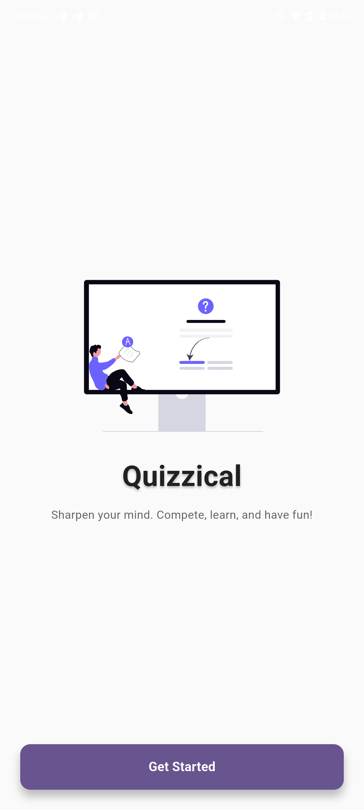
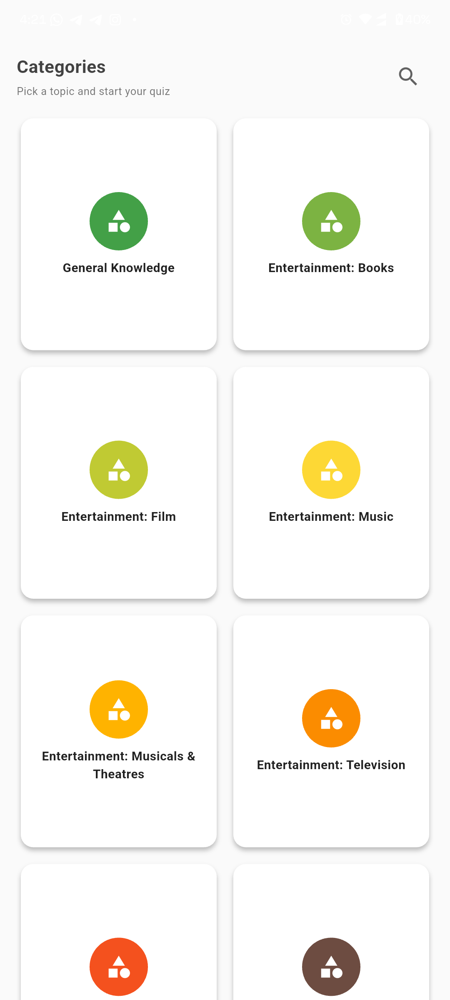
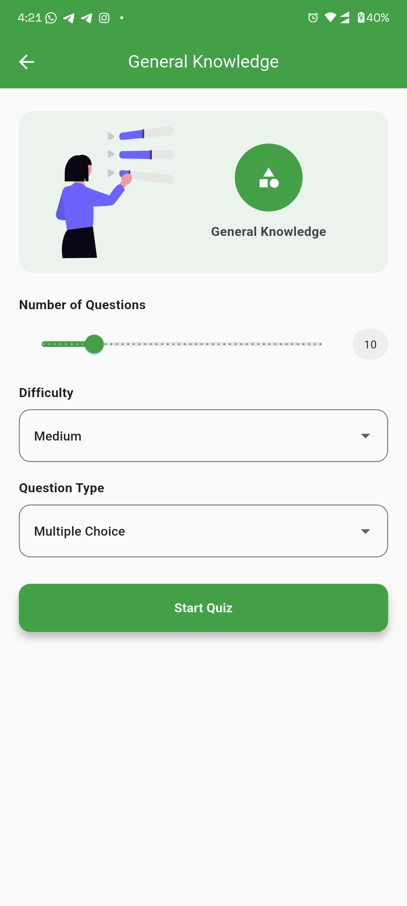
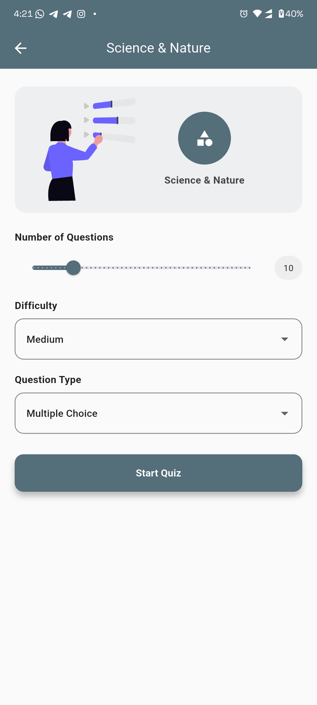
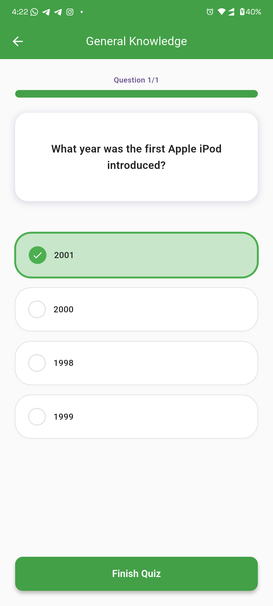
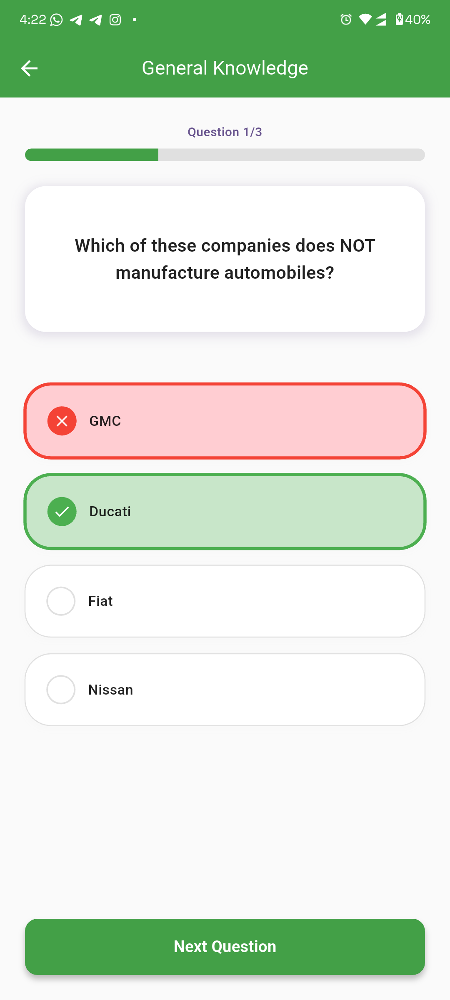
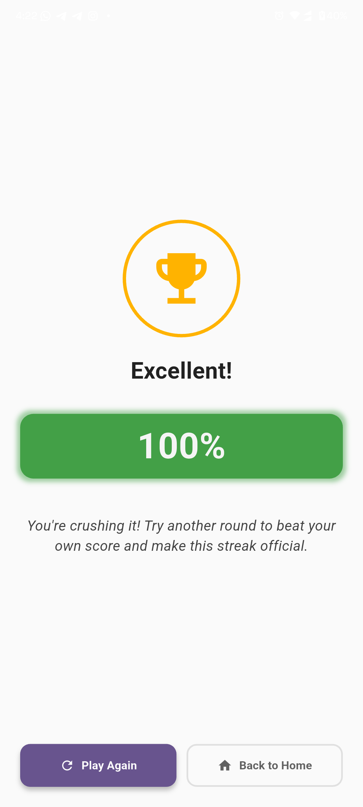
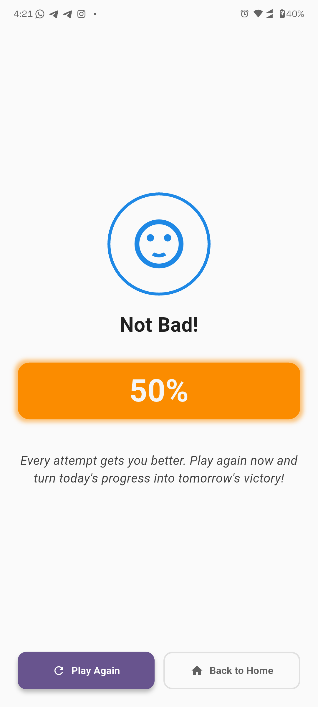
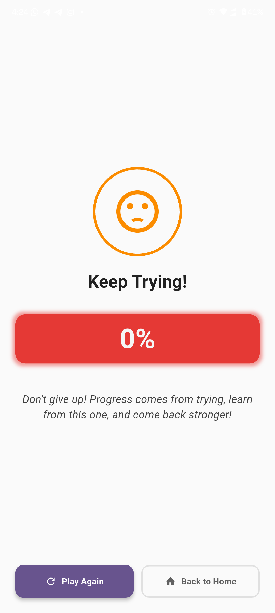

# Quizzical

A lightweight, engaging Flutter quiz app that lets users pick categories, choose quiz length and difficulty, answer questions, and get an encouraging, motivational summary at the end.

This README describes the app, how to run it, and shows screenshots from the current build.

## Key features

- Category-based quizzes with configurable number of questions and difficulty.
- Immediate feedback for correct and incorrect answers.
- Summary score screen with a short, highly motivational quote encouraging the player to play again.
- Clean, responsive UI with SVG assets scaled for different screen sizes.
- Cross-platform: Android, iOS, macOS, Linux, Windows.

## Files of interest

- `lib/main.dart` — app entrypoint.
- `lib/screens/` — UI screens (home, categories, quiz, results, config).
- `assets/images/` — SVG icons used by the UI.
- `screenshot/android/` — example screenshots used below.

## Screenshots

<!-- Use a fixed table layout and the width attribute on images so thumbnails stay at a fixed pixel size and don't stretch -->
<table style="table-layout:fixed; width:660px; margin:0 auto; border-collapse:collapse;">
  <colgroup>
    <col style="width:220px;" />
    <col style="width:220px;" />
    <col style="width:220px;" />
  </colgroup>
  <tr>
    <td style="padding:8px; vertical-align:top; text-align:center;">
      
      
Home

    </td>
    <td style="padding:8px; vertical-align:top; text-align:center;">
      
      
Categories

    </td>
    <td style="padding:8px; vertical-align:top; text-align:center;">
      
      
Quiz configuration (1)

    </td>
  </tr>
  <tr>
    <td style="padding:8px; vertical-align:top; text-align:center;">
      
      
Quiz configuration (2)

    </td>
    <td style="padding:8px; vertical-align:top; text-align:center;">
      
      
Correct answer

    </td>
    <td style="padding:8px; vertical-align:top; text-align:center;">
      
      
Wrong answer

    </td>
  </tr>
  <tr>
    <td style="padding:8px; vertical-align:top; text-align:center;">
      
      
Score — Excellent

    </td>
    <td style="padding:8px; vertical-align:top; text-align:center;">
      
      
Score — Not bad

    </td>
    <td style="padding:8px; vertical-align:top; text-align:center;">
      
      
Score — Keep trying

    </td>
  </tr>
</table>

> Note: If images do not display in your environment (for example some Git hosts require special handling), open the referenced files directly under `screenshot/android/`.

## Contributing

Contributions are welcome. Open an issue or submit a pull request for bug fixes, UI improvements, or additional features (more categories, question sources, analytics, etc.).

## License

This project does not include a license file. Add a `LICENSE` if you intend to publish or share the app under a specific license.
